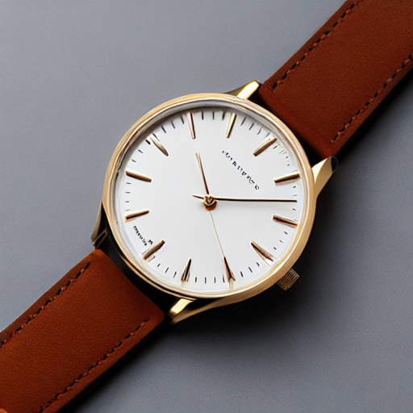
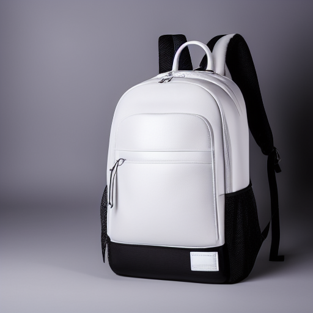
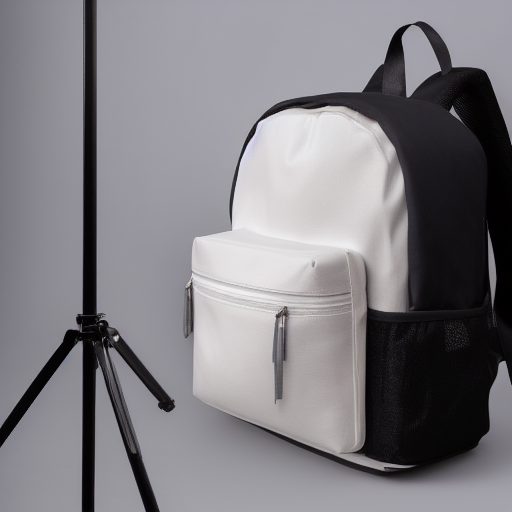
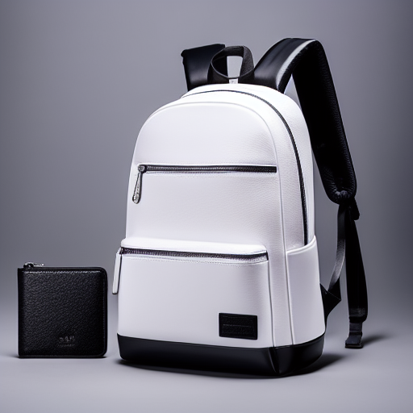
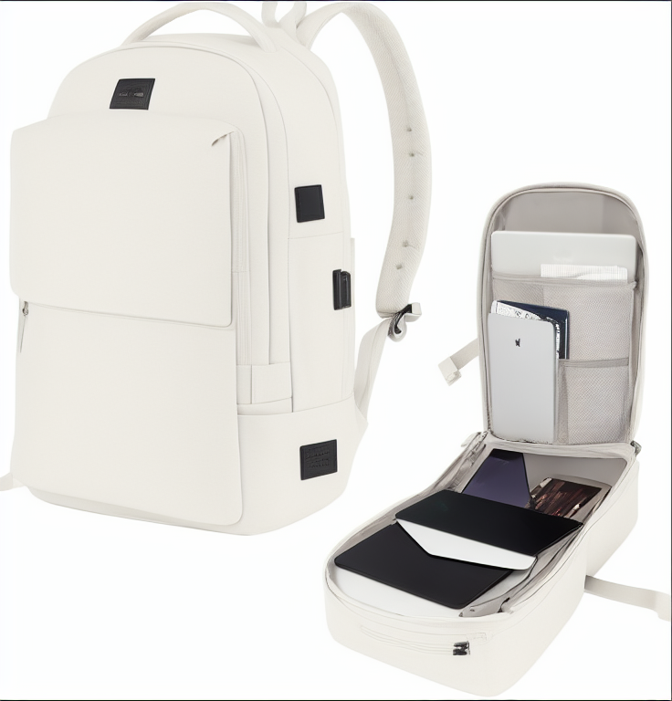
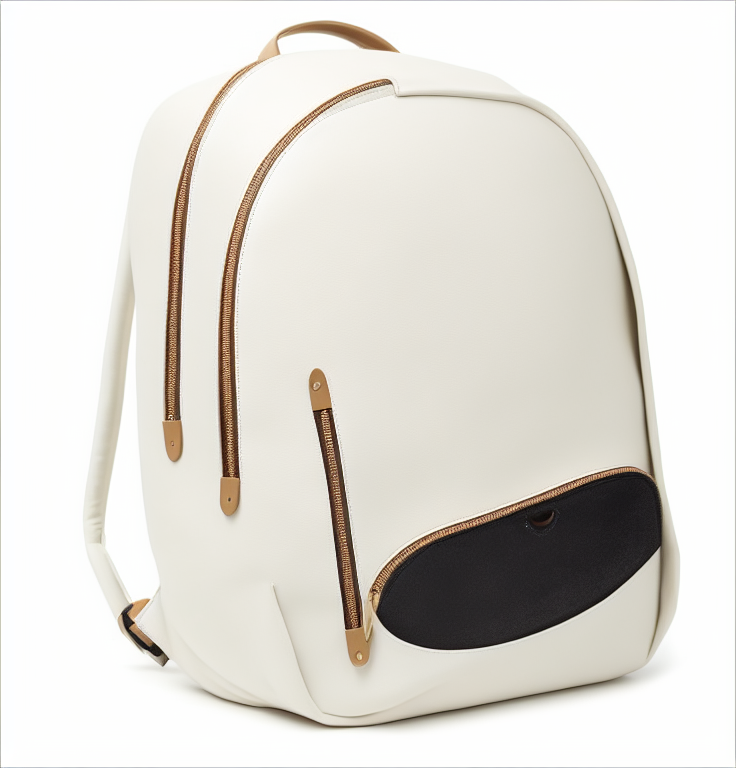

# Exercice 1 :

=> Output image :

# Exercice 2 :

=>baseline.png:

# Exercice 3 :

| Baseline (EulerA, 30, 7.5)  | Steps bas (15)             | Steps haut (50)            |
| --------------------------- | -------------------------- | -------------------------- |
|  |  |  |
| Guidance bas (4.0)          | Guidance haut (12.0)       | Scheduler DDIM             |
|     |   |     |
### Effet du nombre de steps (`num_inference_steps`)

- **Steps bas (15)**  
    L’image converge rapidement mais présente moins de détails fins. Certaines zones (textures, contours) apparaissent plus lisses ou simplifiées, ce qui peut nuire au rendu produit dans un contexte e-commerce.
    
- **Steps intermédiaires (30 – baseline)**  
    Bon compromis entre qualité visuelle et temps de calcul. Les formes sont bien définies, les matériaux crédibles et l’éclairage cohérent.
    
- **Steps élevés (50)**  
    Les détails sont légèrement plus nets et stables, mais l’amélioration reste marginale par rapport à la baseline. Le gain qualitatif ne justifie pas toujours l’augmentation du coût de calcul.

### Effet du guidance scale (`guidance_scale`)

- **Guidance faible (4.0)**  
    L’image est plus libre et créative, mais s’éloigne partiellement du prompt. Certaines caractéristiques attendues du produit sont moins marquées ou ambiguës.
    
- **Guidance standard (7.5 – baseline)**  
    Bon équilibre entre fidélité au prompt et réalisme visuel. Le rendu correspond bien à une photographie produit réaliste.
    
- **Guidance élevé (12.0)**  
    L’image respecte très strictement le prompt, mais peut paraître plus rigide ou artificielle. Le rendu perd légèrement en naturel.

### Effet du scheduler

- **Euler Ancestral (EulerA)**  
    Produit des images avec davantage de contraste et de détails locaux. Le rendu est bien adapté aux scènes de type “product photography”.
    
- **DDIM**  
    Génère des images plus douces et plus lissées, avec moins de micro-détails. La structure globale reste stable mais le rendu est légèrement moins percutant visuellement.

# Exercice 4 :

| Image source (avant)      | Strength = 0.35                | Strength = 0.60                | Strength = 0.85                |
| ------------------------- | ------------------------------ | ------------------------------ | ------------------------------ |
|  |  |  |  |
#### Éléments conservés
- **Forme globale du produit** : le sac à dos reste clairement identifiable dans les trois cas.
- **Identité du produit** : type d’objet, proportions générales et usage (sac à dos e-commerce) sont maintenus.
- **Cadrage global** : position centrale et vue produit cohérente avec une photo e-commerce.

#### Éléments qui changent avec `strength`
- **Strength = 0.35 (faible)**
    - Forte fidélité à l’image source
    - Structure, poches et détails principaux très proches de l’original
    - Changements limités sur les textures et l’éclairage
- **Strength = 0.60 (moyen)**
    - Bon compromis entre fidélité et créativité
    - Textures légèrement modifiées
    - Éclairage et finitions plus “stylisés”
    - Le produit reste clairement reconnaissable
- **Strength = 0.85 (élevé)**
    - Transformation importante de l’apparence
    - Textures, fermetures et détails structurels peuvent changer
    - L’image s’éloigne fortement de la source initiale
    - Risque de perte de cohérence avec le produit réel

Dans un contexte e-commerce, des valeurs **faibles à intermédiaires (0.3–0.6)** sont préférables afin de préserver l’identité et la crédibilité du produit, tandis qu’un `strength` élevé doit être utilisé avec prudence.

# Exercice 5 :

# Exercice 6 :

## Question 6.a -

La grille suivante est utilisée pour évaluer qualitativement les images générées dans un contexte e-commerce :
- **Prompt adherence (0–2)**  
    Fidélité de l’image au prompt textuel (objet, style, contexte).
- **Visual realism (0–2)**  
    Qualité visuelle globale : éclairage, matériaux, cohérence physique.
- **Artifacts (0–2)**  
    Présence d’artefacts gênants (déformations, texte halluciné, incohérences).  
    _2 = aucun artefact gênant._
- **E-commerce usability (0–2)**  
    Utilisabilité commerciale : image publiable après retouches mineures.  
    _2 = directement exploitable._
- **Reproducibility (0–2)**  
    Suffisance des paramètres fournis pour reproduire le résultat.
## Question 6.b -

|Image|Type|Prompt adherence (0–2)|Visual realism (0–2)|Artifacts (0–2)|E-commerce usability (0–2)|Reproducibility (0–2)|**Total (/10)**|
|---|---|--:|--:|--:|--:|--:|--:|
|Image 1|Text2Img baseline(EulerA, steps=30, guidance=7.5)|2|2|2|2|2|**10**|
|Image 2|Text2Img “extrême”(guidance élevé)|2|1|1|1|2|**7**|
|Image 3|Img2Img(strength = 0.85)|1|1|1|0|2|**5**|

#### Image 1 — Text2Img baseline
- Très bonne correspondance avec le prompt e-commerce (produit, fond blanc, éclairage studio).
- Rendu réaliste, sans artefacts visibles ni texte halluciné.
- Paramètres complets et clairement définis, assurant une excellente reproductibilité.
#### Image 2 — Text2Img “extrême”
- Le prompt est respecté mais le rendu est plus rigide et moins naturel.
- Certains détails apparaissent sur-accentués.
- Image reproductible mais nécessitant des ajustements avant un usage commercial.
#### Image 3 — Img2Img à strength élevé
- Transformation importante par rapport à l’image source.
- Identité du produit partiellement altérée.
- Résultat difficilement exploitable en e-commerce car potentiellement trompeur.

## Question 6.c -

L’ajustement des paramètres de diffusion met en évidence un compromis clair entre **qualité visuelle, latence et coût de calcul**.  
Augmenter le nombre de steps ou utiliser certains schedulers améliore la stabilité et les détails, mais au prix d’un temps de génération plus élevé, ce qui peut être limitant en production e-commerce.

La **reproductibilité** repose sur la maîtrise de paramètres clés : seed, scheduler, steps, guidance et (en Img2Img) strength. Toute modification non contrôlée de ces paramètres peut produire des variations significatives, rendant difficile la comparaison ou la validation métier.

En contexte e-commerce, les principaux risques sont les **hallucinations visuelles**, les **images trompeuses**, et la **non-conformité** (logos inventés, texte généré, détails inexistants).  
Pour limiter ces risques, il est essentiel de :
- privilégier des valeurs de guidance et de strength modérées,
- utiliser des prompts et negative prompts stricts,
- intégrer une validation humaine avant publication.