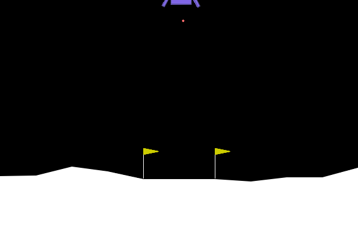
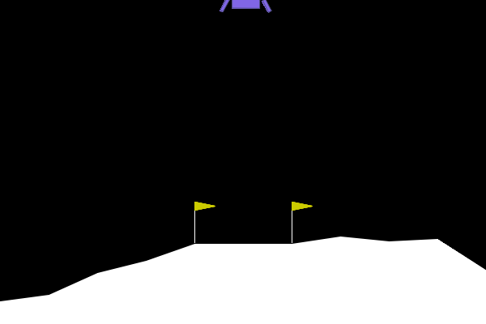
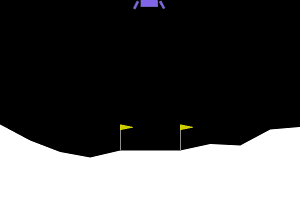
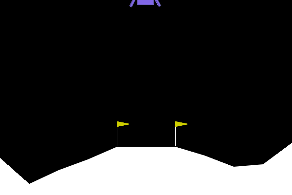

# Exercice 1 :

## Résultats de l’agent aléatoire

Lors de l’exécution, l’agent aléatoire a obtenu les métriques suivantes :

- Issue du vol : Crash détecté 💥  
- Récompense totale cumulée : −460.79  
- Durée du vol : 107 frames  
- Allumages moteur principal : 31  
- Allumages moteurs latéraux : 47  

Un agent est considéré comme résolvant l’environnement LunarLander-v3
s’il atteint un score moyen supérieur ou égal à +200.

L’agent aléatoire obtient un score de −460.79, soit un écart de :
660.79 points en dessous du seuil requis.
## Conclusion

L’agent aléatoire est extrêmement loin de résoudre l’environnement.
Son comportement non structuré entraîne un crash et une forte pénalité,
montrant qu’un algorithme d’apprentissage par renforcement est nécessaire
pour apprendre une politique de contrôle efficace.
# Exercice 2 :

### Évolution de la récompense moyenne (ep_rew_mean)

Au début de l’entraînement, ep_rew_mean était d’environ −175.
À la fin de l’entraînement, elle atteint environ +189.

Cela représente une amélioration d’environ +364 points,
montrant que l’agent apprend progressivement une politique efficace.

### Résultats du vol avec l’agent PPO

- Issue du vol : Atterrissage réussi 🏆
- Récompense totale : 241.92
- Allumages moteur principal : 183
- Allumages moteurs latéraux : 143
- Durée du vol : 353 frames

L’agent aléatoire obtenait un score de −460.79 et crashait,
tandis que l’agent PPO réalise un atterrissage réussi avec un score positif.

Le PPO utilise davantage les moteurs, mais de façon contrôlée,
ce qui permet un vol plus long et stable.
### Conclusion
Avec un score de 241.92, supérieur au seuil de +200,
l’agent PPO peut être considéré comme résolvant l’environnement LunarLander-v3.

# Exercice 3 :

### Évolution de `ep_rew_mean`
Avec le wrapper qui pénalise fortement le moteur principal (−50), `ep_rew_mean` a commencé à environ −1.33e+3 (≈ −1330) puis a progressé jusqu’à ≈ −111 en fin d’entraînement, soit une amélioration d’environ +1219 points.  
Cela indique que l’agent apprend principalement à éviter la pénalité artificielle.

### Stratégie observée (GIF + télémétrie)
Lors de l’évaluation sur l’environnement normal, l’agent adopte une politique extrême :
- 0 allumage du moteur principal
- usage des moteurs latéraux uniquement

Résultat : crash rapide (56 frames) avec un score total de −106.25.

### Pourquoi c’est “optimal” pour l’agent (logique/math)
Le wrapper modifie la récompense pendant l’entraînement :
si l’action 2 (moteur principal) est utilisée, la récompense devient `r' = r − 50`.
L’agent PPO maximise le retour cumulé `G = Σ γ^t r'_t`.  
La pénalité −50 domine largement les autres termes de récompense. Il devient donc rationnel, du point de vue de `r'`, de ne jamais choisir l’action 2.  
Même si cela rend l’atterrissage presque impossible dans l’environnement réel, cette politique maximise mieux la récompense modifiée : c’est un cas typique de *reward hacking*.

# Exercice 4 :

Lors de l’évaluation avec une gravité réduite (−2.0), l’agent obtient :

- Issue : Atterrissage réussi 🏆
- Récompense totale : 242.46
- Allumages moteur principal : 66
- Allumages moteurs latéraux : 559
- Durée du vol : 923 frames

### Observation du comportement

Le vaisseau ne se pose pas de manière fluide.  
Il reste longtemps en l’air et oscille fortement, avec de nombreuses corrections latérales.  
La descente est lente et instable, signe d’une politique mal calibrée pour cette nouvelle physique.

### Explication technique

Le modèle a été entraîné avec une gravité proche de −10.  
Avec une gravité de −2, la dynamique du système change : la chute est plus lente et les timings appris pour activer les moteurs ne correspondent plus.  

La politique PPO, optimisée pour la distribution d’entraînement, se retrouve hors distribution (OOD).  
Elle applique des corrections excessives, ce qui explique l’augmentation massive des actions latérales et la durée de vol plus longue.
### Conclusion
L’agent parvient toujours à accomplir la tâche, mais avec un comportement inefficace et instable.  
Cela illustre la difficulté de généralisation en RL : un modèle performant en environnement d’entraînement peut se dégrader lorsque la physique change légèrement.
# Exercice 5 :
## Réduction du Sim-to-Real Gap

Pour rendre l’agent robuste aux variations de gravité et de dynamique sans entraîner un modèle spécifique pour chaque environnement, plusieurs stratégies peuvent être mises en place.

### 1. Domain Randomization
Pendant l’entraînement, les paramètres physiques (gravité, vent, puissance moteur) sont tirés aléatoirement à chaque épisode.  
L’agent apprend alors une politique robuste à toute une distribution d’environnements, et non à un seul cas particulier.

### 2. Enrichissement de l’état avec les paramètres physiques
On peut fournir à l’agent des informations supplémentaires, comme la gravité actuelle.  
La politique devient alors conditionnelle à l’environnement et peut adapter son contrôle en conséquence.

### 3. Ajout de bruit et de perturbations
Introduire du bruit sur les observations ou les actions pendant l’entraînement permet d’obtenir une politique plus stable et plus robuste aux variations du monde réel.

### Conclusion
Ces approches permettent d’améliorer la généralisation sans changer l’algorithme d’apprentissage, en agissant uniquement sur les données et l’environnement d’entraînement.