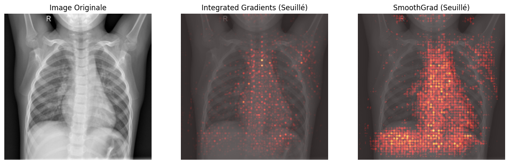
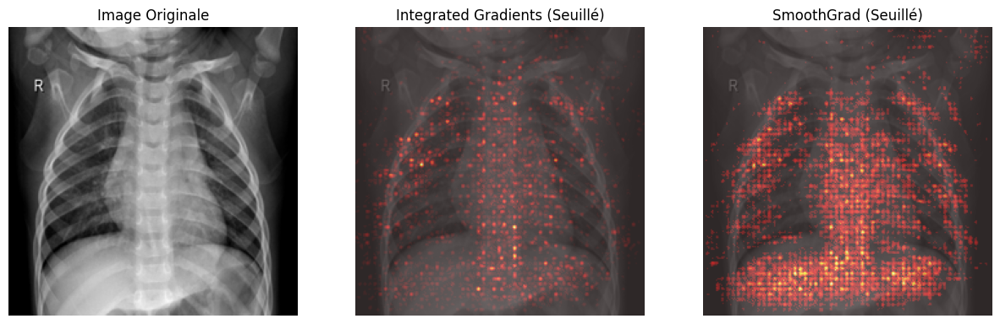
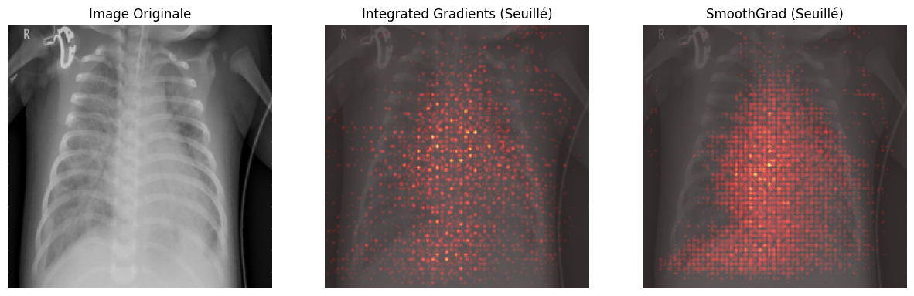
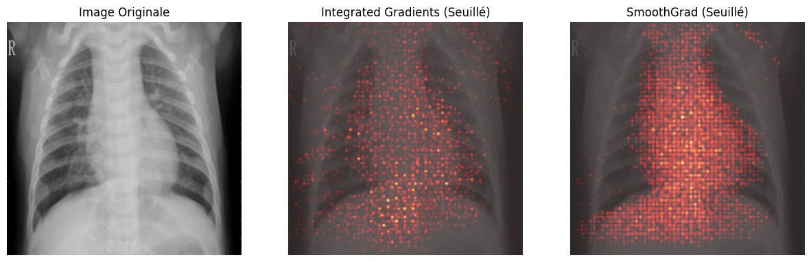
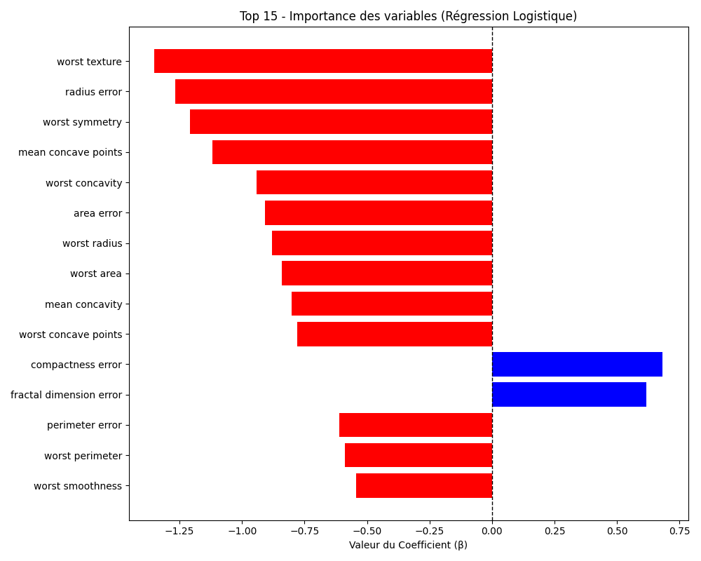
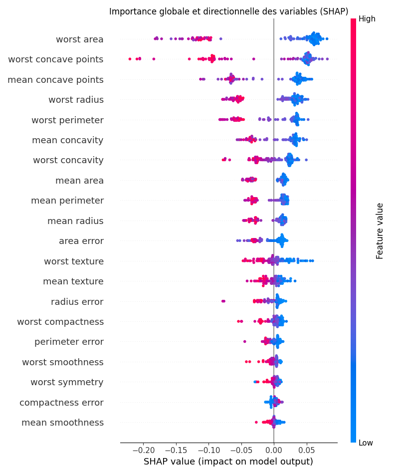
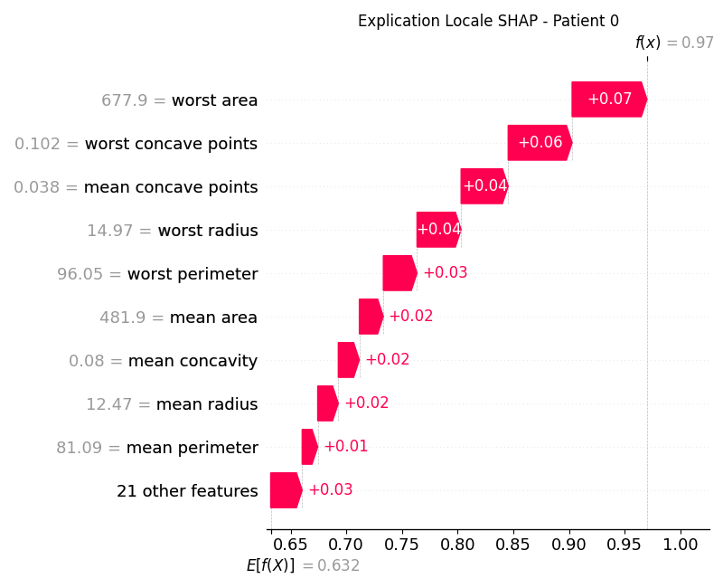

# Exercice 1 :

| normal_1.jpeg                            | normal_2.jpeg                            | pneumo_1.jpeg                            | pneumo_2.jpeg                            |
| ---------------------------------------- | ---------------------------------------- | ---------------------------------------- | ---------------------------------------- |
|  |  |  |  |

Le modèle classe correctement les quatre images de test, et les cartes Grad-CAM montrent que les activations sont principalement concentrées dans les régions pulmonaires, ce qui suggère que les prédictions reposent sur des caractéristiques anatomiques pertinentes plutôt que sur des artefacts manifestes. Dans les cas de pneumonie, les zones mises en évidence sont plus localisées et asymétriques, ce qui correspond à des anomalies pulmonaires. L'aspect grossier des cartes thermiques est dû au fait que Grad-CAM est calculé sur la dernière couche de convolution, dont la résolution spatiale est réduite par les opérations de sous-échantillonnage successives du ResNet. Lorsque cette carte basse résolution est suréchantillonnée à la taille d'entrée, elle produit l'aspect par blocs observé.

# Exercice 2 :
| File                        | normal_1.jpeg               | normal_2.jpeg               | pneumo_1.jpeg               | pneumo_2.jpeg               |
| --------------------------- | --------------------------- | --------------------------- | --------------------------- | --------------------------- |
| Generated image             |  |  |  |  |
| Temps d'inférence           | 0.0193s                     | 0.0252s                     | 0.0187s                     | 0.0168s                     |
| Temps IG pur                | 0.5436s                     | 0.5674s                     | 0.3978s                     | 0.4028s                     |
| Temps SmoothGrad (IG x 100) | 112.7824s                   | 113.2761s                   | 112.5392s                   | 112.7413s                   |
| Classe prédite              | NORMAL                      | NORMAL                      | PNEUMONIA                   | PNEUMONIA                   |

### Faisabilité en temps réel
Compte tenu du coût de calcul élevé, la génération synchrone des explications SmoothGrad dès le premier clic d'analyse ne serait pas techniquement réalisable en milieu clinique.
La prédiction elle-même peut être affichée instantanément, mais l'explication introduirait une latence inacceptable.
### Architecture logicielle proposée
Une approche pratique consisterait à calculer les explications de manière asynchrone à l'aide d'un processus en arrière-plan connecté à une file d'attente (par exemple, un courtier de messages et un processeur graphique), permettant ainsi aux cliniciens de recevoir la prédiction immédiatement pendant que l'explication est générée en parallèle.
### Avantage de la prise en compte des attributions négatives (bleu vs rouge)
Contrairement à Grad-CAM, Integrated Gradients conserve les contributions positives et négatives.
Cela fournit une explication mathématique plus fidèle : les valeurs positives mettent en évidence les pixels qui confirment la prédiction, tandis que les valeurs négatives indiquent les régions qui la contredisent.
Le fait de conserver des informations inférieures à zéro permet ainsi de saisir les arguments pour et contre la décision du modèle, améliorant ainsi l'interprétabilité.
# Exercice 3 :

### Feature la plus influente vers la classe Maligne  
En observant le graphique des coefficients, la variable **worst texture** possède le coefficient négatif de plus grande amplitude.  
Elle est donc la caractéristique ayant le plus d’impact pour pousser la prédiction vers la classe **Maligne (classe 0)**.  
  
### Avantage d’un modèle intrinsèquement interprétable  
L’avantage principal d’un modèle glass-box comme la régression logistique est que l’explication est directement fournie par les coefficients du modèle, sans approximation supplémentaire, ce qui garantit une interprétation fidèle et immédiate du mécanisme de décision contrairement aux méthodes post-hoc.

# Exercice 4 :

### Explicabilité Globale  
En observant le Summary Plot, les variables les plus influentes sont notamment :  
- worst area  
- worst concave points  
- mean concave points  
  
Ces caractéristiques figurent également parmi les plus importantes dans la Régression Logistique (Exercice 3).  
Cette cohérence entre deux modèles très différents (linéaire et ensemble non linéaire) suggère que ces variables sont des biomarqueurs robustes et réellement informatifs pour distinguer les tumeurs bénignes des tumeurs malignes.   
### Explicabilité Locale (Patient 0)  
D’après le Waterfall Plot du patient 0, la caractéristique ayant le plus contribué à pousser la prédiction vers sa valeur finale est :  
-> worst area = 677.9  
C’est la variable avec la contribution positive la plus importante (+0.07), indiquant qu’elle joue un rôle majeur dans la probabilité prédite pour ce patient.  
### Interprétation globale  
Le Random Forest, bien que plus complexe et non linéaire, met en évidence des variables très similaires à celles du modèle glass-box, ce qui renforce la confiance dans l’interprétation clinique du modèle et dans la stabilité des facteurs explicatifs identifiés.